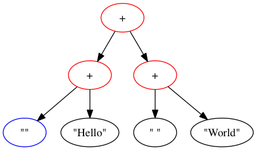
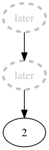
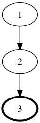

free-graphs
===========

Generate GraphViz graphs by interpretting free monads.

Examples
--------

These examples can be run like so:

    $ cabal sandbox init
    $ cabal install --only-dependencies
    $ cabal install markdown-unlit
    $ cabal repl --ghc-options="-package transformers -pgmL .cabal-sandbox/bin/markdown-unlit README.lhs"
    *Data.Graph.Free> Example.runAll

~~~ {.haskell}
module Example where

import Control.Comonad.Cofree
import Control.Monad.Free
import Data.Foldable
import Data.Functor.Identity
import Data.Graph.Cofree
import Data.Graph.Free
import Data.Graph.Inductive.Tree
import Data.GraphViz
import Data.Monoid

runAll :: IO ()
runAll = fmonoid >> partiality >> nonEmptyList

generate :: Gr f () -> (f -> Attributes) -> String -> IO ()
generate g a n = fmap (const ()) . runGraphviz (graphToDot (formatted a defaultParams) g) Png $ n ++ ".png"
~~~

### Monoid

~~~ {.haskell}
data FMonoid a = MAppend a a
               | MEmpty

instance Foldable FMonoid where
    foldMap f (MAppend a b) = f a `mappend` f b
    foldMap _ MEmpty = mempty

fmonoidAttributes :: Free FMonoid String -> Attributes
fmonoidAttributes (Free (MAppend _ _)) = [toLabel "+", color Red]
fmonoidAttributes (Free MEmpty) = [toLabel (show ""), color Blue]
fmonoidAttributes (Pure s) = [toLabel $ show s]

fmonoidGraph :: Gr (Free FMonoid String) ()
fmonoidGraph = freeFoldableGraph (Free (MAppend (Free (MAppend (Free MEmpty) (Pure "Hello"))) (Free (MAppend (Pure " ") (Pure "World")))))

fmonoid :: IO ()
fmonoid = generate fmonoidGraph fmonoidAttributes "fmonoid"
~~~

### Partiality

~~~ {.haskell}
partialityAttributes :: Free Identity Int -> Attributes
partialityAttributes (Free _) = [style dashed, penWidth 3, fontColor Gray, color Gray, toLabel "later"]
partialityAttributes (Pure i) = [toLabel (show i)]

partialityGraph :: Gr (Free Identity Int) ()
partialityGraph = freeFoldableGraph (Free (Identity (Free (Identity (Pure 2)))))

partiality :: IO ()
partiality = generate partialityGraph partialityAttributes "partiality"
~~~~

### Non-empty list

~~~ {.haskell}
nonEmptyListAttributes :: Cofree Maybe Int -> Attributes
nonEmptyListAttributes (a :< Nothing) = [toLabel (show a), penWidth 3]
nonEmptyListAttributes (a :< _) = [toLabel (show a)]

nonEmptyListGraph :: Gr (Cofree Maybe Int) ()
nonEmptyListGraph = cofreeFoldableGraph (1 :< Just (2 :< Just (3 :< Nothing)))

nonEmptyList :: IO ()
nonEmptyList = generate nonEmptyListGraph nonEmptyListAttributes "nonemptylist"
~~~
